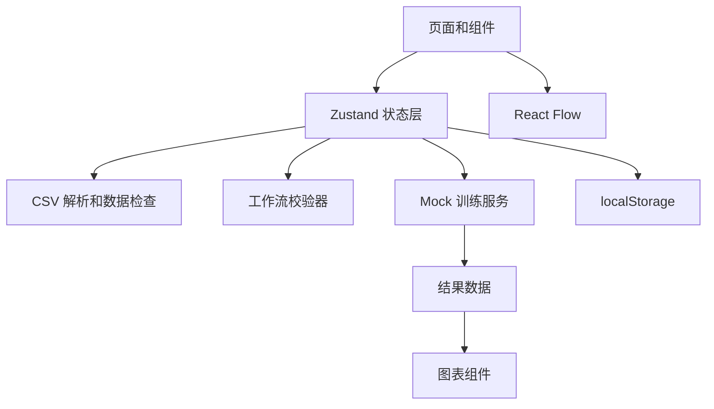

# 一体化机器学习训练平台（桌面 Web 前端）开发文档

## 1. 项目概述

| 项目 | 内容 |
| --- | --- |
| 产品名称 | ML Studio（暂定） |
| 版本 | MVP 1.0 |
| 目标用户 | 无机器学习工程经验的初学者 |
| 建设范围 | 仅桌面 Web 前端；不接入真实模型训练服务 |
| 支持任务 | 二分类、回归 |
| 核心方式 | 上传 CSV、检查数据、拖拽搭建流程、模拟训练、查看结果 |

ML Studio 是一个面向初学者的可视化机器学习训练平台。用户无需写代码，通过点击、拖拽和连线完成模型训练流程，并查看通俗化的模型评估结果。

## 2. 已确认的设计决策

| 决策项 | MVP 结论 |
| --- | --- |
| 视觉风格 | 浅色、清爽的教育产品风格；蓝色为主操作色 |
| 产品重点 | 让用户尽快完成“第一个模型”的训练 |
| 画布交互 | 受引导的自由画布：可自由拖拽、连线，但系统按步骤提示 |
| 初始画布 | 默认展示“数据集”和“选择目标列”节点 |
| 数据来源 | 浏览器本地解析真实 CSV，并提供内置示例数据 |
| 数据检查 | 展示每列类型与一致性，支持用户修正类型和处理异常值 |
| 模型范围 | 二分类和回归；不支持多分类 |
| 参数配置 | 默认显示少量关键参数，高级参数折叠 |
| 数据处理 | 缺失值处理、标准化、训练/测试集划分 |
| 训练体验 | 5–8 秒模拟训练，包含分阶段进度、日志和取消操作 |
| 分类评估 | 准确率、AUC、KS、Gain Table、混淆矩阵等 |
| 模型管理 | 本地自动保存工作流与训练成功后的模型记录 |
| 设备范围 | 仅桌面 Web；设计基准 1440px，最低支持 1280px |

## 3. 产品目标与边界

### 3.1 产品目标

- 让初学者在没有代码经验的情况下完成一次模型训练。
- 用可视化工作流解释机器学习的基础步骤。
- 通过数据检查减少因 CSV 字段问题导致的训练失败。
- 使用通俗语言解释训练指标和结果。
- 为未来接入真实后端服务保留清晰的接口边界。

### 3.2 MVP 不做的功能

- 不执行真实数据清洗、特征工程和模型训练。
- 不提供登录、权限、团队协作、云端存储和计费。
- 不支持多分类、聚类、时间序列、深度学习和自动调参。
- 不支持 Excel、数据库、云端数据源。
- 不支持报告导出、模型部署、在线预测和批量预测。
- 不支持平板、手机端适配。
- 不支持复杂 CSV 兼容：首版只接受 UTF-8、逗号分隔、包含表头的 CSV。
- 不提供版本分支、模板市场和复杂项目管理。

除本文件明确列出的内容外，不新增功能。新增需求应先评估是否服务于核心路径：导入数据、检查数据、搭建流程、模拟训练、查看结果。

## 4. 用户主流程


### 4.1 最短成功路径

1. 用户在首页点击“创建第一个模型”。
2. 用户选择示例数据集，或上传符合要求的 CSV。
3. 用户检查每列数据类型，修正必要字段，并选择目标列。
4. 系统推荐二分类或回归任务；用户确认后进入工作流编辑器。
5. 用户点击“智能推荐流程”，或自行拖入处理和模型节点。
6. 用户点击“开始训练”，查看模拟进度和日志。
7. 用户进入结果页，阅读指标、图表和解释。

## 5. 页面与导航

```text
应用
├─ 首页
├─ 数据集
├─ 工作流编辑器
├─ 训练结果
└─ 模型库
```

| 页面 | 目的 | MVP 内容 |
| --- | --- | --- |
| 首页 | 启动训练 | 创建项目、使用示例数据开始、上传 CSV 开始、最近项目 |
| 数据集 | 检查和配置数据 | 上传区、字段表、数据预览、字段类型和异常处理、目标列选择 |
| 工作流编辑器 | 搭建训练步骤 | 工具栏、节点库、画布、属性面板、训练控制台 |
| 训练结果 | 解读模型效果 | 核心结论、指标、图表、结果说明、返回编辑器 |
| 模型库 | 查看历史成果 | 本地模型记录、模型指标、训练时间、打开结果 |

## 6. 数据集功能

### 6.1 数据来源

- 本地 CSV：使用浏览器在本地读取文件，不上传服务器。
- 内置示例数据：
  - 客户流失预测：二分类，用于展示 AUC、KS、Gain Table。
  - 信用风险评估：二分类，用于展示正类、阈值和风险识别。
  - 房价预测：回归，用于展示 MAE、RMSE、R²。

### 6.2 CSV 上传规则

- 仅支持 UTF-8 编码、逗号分隔、第一行为字段名的 CSV。
- 页面提供拖拽上传和点击上传入口。
- 上传后显示文件名、文件大小、行数、列数和前 10 行数据预览。
- 格式不符合要求时给出明确错误提示，不进入后续流程。

### 6.3 字段类型检查

系统逐列推断并展示以下信息：

| 信息 | 说明 |
| --- | --- |
| 字段名 | CSV 表头名称 |
| 推断类型 | 数值、类别、日期、布尔值、文本 |
| 非空值数量 | 可用于计算的值数量 |
| 缺失值数量 | 空白或无效值数量 |
| 唯一值数量 | 去重后的值数量 |
| 一致性状态 | 该列是否存在混合类型或格式异常 |
| 异常样例 | 例如数值列中出现“未知” |

### 6.4 用户可执行的数据处理

- 手动将字段改为数值、类别、日期、布尔或文本。
- 对混合类型字段选择以下一种处理方式：
  - 将无法转换的值设为空；
  - 删除包含异常值的行；
  - 排除该字段，不将其用于训练。
- 操作后实时显示受影响的行数。
- 存在未处理的类型冲突时，开始训练按钮提示用户先完成处理。

### 6.5 目标列与任务类型

- 用户从字段中选择一个目标列，即模型需要预测的字段。
- 有限类别的目标列默认推荐二分类；连续数值默认推荐回归。
- 用户可手动覆盖系统推荐。
- 二分类任务需指定正类；系统给出推荐，用户可以确认或修改。

## 7. 工作流编辑器

### 7.1 页面布局

| 区域 | 内容 |
| --- | --- |
| 顶部工具栏 | 项目名称、保存、撤销、重做、智能推荐流程、开始训练 |
| 左侧组件库 | 按数据、处理、模型、输出分组的可拖拽节点 |
| 中间画布 | 节点拖拽、连线、缩放、平移、缩略图、自动布局 |
| 右侧属性面板 | 节点说明、关键参数、高级参数和错误提示 |
| 底部控制台 | 当前训练阶段、进度、日志、取消训练 |

### 7.2 初始状态与引导

- 新建流程时，画布默认放入“数据集”和“选择目标列”两个节点。
- 用户完成当前步骤后，系统高亮下一步建议使用的节点和可连接端口。
- 允许自由拖拽和合法连线，但阻止不合法连接并说明原因。
- “智能推荐流程”根据当前任务类型生成基础可运行流程。

### 7.3 节点清单

| 类别 | 节点 | 用途 |
| --- | --- | --- |
| 数据 | 数据集 | 选择用于训练的表格数据 |
| 数据 | 选择目标列 | 选择预测字段，并确认二分类正类 |
| 处理 | 缺失值处理 | 处理空白或缺失数据 |
| 处理 | 标准化 | 统一数值特征的尺度 |
| 处理 | 划分训练集 | 将数据按默认 80%/20% 分为训练集和测试集 |
| 二分类模型 | 逻辑回归 | 基础二分类模型 |
| 二分类模型 | 决策树分类 | 基于规则判断的分类模型 |
| 二分类模型 | 随机森林分类 | 多棵决策树共同投票 |
| 二分类模型 | KNN 分类 | 参考相近样本进行分类 |
| 回归模型 | 线性回归 | 基础连续数值预测模型 |
| 回归模型 | 决策树回归 | 基于规则预测数值 |
| 回归模型 | 随机森林回归 | 多棵回归树共同预测 |
| 输出 | 模型评估 | 基于测试集生成模型效果 |

### 7.4 连接与校验规则

- 数据集必须是起点，目标列节点只能连接数据集。
- 处理节点位于数据节点和模型节点之间；缺失值处理与标准化均可跳过。
- 二分类项目只能使用二分类模型，回归项目只能使用回归模型。
- 模型评估必须同时连接模型输出和测试数据。
- 禁止循环连接。
- 不完整流程不能开始训练。

| 校验项 | 提示文案 |
| --- | --- |
| 未选择数据集 | 请先添加一个数据集节点。 |
| 未选择目标列 | 请在“选择目标列”节点中指定需要预测的字段。 |
| 未确认正类 | 请确认需要重点识别的正类。 |
| 未添加模型 | 请添加一个二分类或回归模型。 |
| 模型不匹配 | 当前任务类型与所选模型不匹配。 |
| 未添加评估 | 请添加“模型评估”节点以查看训练效果。 |
| 节点未连接 | 请检查节点连接，确保数据能流向模型和评估节点。 |
| 存在循环 | 工作流不能形成循环连接。 |

### 7.5 节点配置

- 每个节点显示简短说明、适用场景和下一步提示。
- 默认只展示常用参数，高级参数折叠。
- 所有参数均有默认值和白话解释。

| 节点 | 默认显示的参数 |
| --- | --- |
| 缺失值处理 | 数值填充方式、文本填充方式 |
| 标准化 | 是否启用 |
| 划分训练集 | 训练集比例，默认 80% |
| 决策树 | 最大深度、最小叶子样本数 |
| 随机森林 | 树数量、最大深度 |
| KNN | 邻居数量 |

## 8. 模拟训练

### 8.1 训练过程

点击“开始训练”后，先执行工作流校验；校验通过后进入模拟训练。总时长控制在 5–8 秒，用户可随时取消。

| 阶段 | 进度 | 说明 |
| --- | --- | --- |
| 验证工作流 | 0%–10% | 检查数据、节点与连接是否完整 |
| 检查数据 | 10%–25% | 检查字段类型与缺失值处理 |
| 准备特征 | 25%–45% | 准备模型输入字段 |
| 训练模型 | 45%–80% | 模拟模型学习过程 |
| 评估模型 | 80%–95% | 在测试集上计算指标 |
| 生成报告 | 95%–100% | 生成图表和文字说明 |

### 8.2 日志与状态

- 显示当前阶段、进度条和简明训练日志。
- 支持状态：未运行、校验中、训练中、成功、失败、已取消。
- 取消后保留工作流和数据配置，不保存新的模型记录。
- 成功后自动进入结果页。

### 8.3 Mock 结果原则

- 使用“数据集 ID + 模型类型 + 参数”生成稳定的模拟结果。
- 不同模型的结果应有合理差异，刷新后不应大幅变化。
- 训练结果只用于前端演示，不代表真实机器学习效果。

## 9. 结果页

### 9.1 结果层级

结果页采用两层信息：

1. 顶部先给出用户容易理解的结论和核心分数。
2. 下方提供图表与详细指标，供用户进一步学习。

### 9.2 二分类结果

| 区域 | 内容 |
| --- | --- |
| 核心结论 | 准确率、AUC、KS 和一句通俗解读 |
| 曲线分析 | ROC 曲线、KS 曲线 |
| 分类效果 | 混淆矩阵、精确率、召回率、F1 分数 |
| 业务分析 | Gain Table：按预测概率分箱展示样本数、正例数、累计捕获率、累计响应率与 Lift |
| 模型解释 | 特征重要性和模型改进建议 |

### 9.3 回归结果

| 区域 | 内容 |
| --- | --- |
| 核心结论 | MAE、RMSE、R² 和一句通俗解读 |
| 预测效果 | 真实值与预测值对比图 |
| 误差分析 | 残差图和平均误差说明 |
| 模型解释 | 特征重要性和模型改进建议 |

### 9.4 模型库

- 每次训练成功后，自动生成一条本地模型记录。
- 记录包括模型名称、任务类型、核心指标、训练时间和来源项目。
- 用户可从模型库打开结果，或回到来源工作流继续调整。

## 10. 视觉与桌面端规范

### 10.1 视觉语言

- 浅色背景、清晰卡片、适度留白，避免重型“科技控制台”风格。
- 蓝色用于主按钮、当前步骤和已选择状态。
- 绿色用于成功，橙色用于提醒，红色仅用于错误。
- 颜色必须与图标或文字结合，不能单独承载状态含义。
- 术语首次出现时提供简短说明，正文优先使用短句。

### 10.2 布局限制

- 以 1440px 为设计基准，最低支持 1280px 宽度。
- 1280px 及以上展示完整五区域工作流编辑器。
- 小于 1280px 时显示“请使用更大屏幕访问工作流编辑器”的提示。

### 10.3 可访问性

- 所有按钮、表单和主要操作都支持键盘访问。
- 表单错误提供明确文字，不只依赖颜色或边框。
- 图表提供标题与文本摘要。
- 动画尊重系统的“减少动态效果”偏好。

## 11. 技术方案

| 层级 | 技术 | 用途 |
| --- | --- | --- |
| 应用框架 | React + TypeScript + Vite | 单页应用、类型安全、开发构建 |
| 样式 | Tailwind CSS | 设计系统和桌面端布局 |
| 路由 | React Router | 首页、数据集、画布、结果、模型库路由 |
| 工作流画布 | React Flow | 节点、端口、连线、缩放和缩略图 |
| 状态管理 | Zustand | 项目、数据集、工作流和训练状态 |
| 表单校验 | React Hook Form + Zod | 节点参数与字段类型编辑 |
| CSV 解析 | Papa Parse | 浏览器端 CSV 读取与预览 |
| 图表 | Recharts | 曲线、柱图、残差图与特征重要性 |
| 图标 | Lucide React | 统一图标 |
| 本地持久化 | localStorage | 项目、工作流和模型记录保存 |

### 11.1 模块结构



### 11.2 推荐目录结构

```text
src/
├─ app/
│  ├─ App.tsx
│  └─ router.tsx
├─ pages/
│  ├─ HomePage.tsx
│  ├─ DatasetPage.tsx
│  ├─ WorkflowPage.tsx
│  ├─ ResultsPage.tsx
│  └─ ModelLibraryPage.tsx
├─ components/
│  ├─ layout/
│  ├─ dataset/
│  ├─ workflow/
│  ├─ training/
│  ├─ results/
│  └─ ui/
├─ stores/
│  ├─ projectStore.ts
│  ├─ workflowStore.ts
│  └─ trainingStore.ts
├─ services/
│  ├─ csvService.ts
│  ├─ mockTrainingService.ts
│  └─ storageService.ts
├─ mocks/
│  ├─ datasets.ts
│  └─ trainingResults.ts
├─ types/
│  ├─ project.ts
│  ├─ dataset.ts
│  ├─ workflow.ts
│  └─ training.ts
└─ utils/
   ├─ dataTypeInference.ts
   ├─ workflowValidation.ts
   └─ metricFormatter.ts
```

## 12. 核心数据模型

```ts
type TaskType = 'binary-classification' | 'regression';
type ColumnType = 'number' | 'category' | 'date' | 'boolean' | 'text';

interface DatasetColumn {
  id: string;
  name: string;
  inferredType: ColumnType;
  selectedType: ColumnType;
  nonNullCount: number;
  missingCount: number;
  uniqueCount: number;
  invalidExamples: string[];
}

interface Dataset {
  id: string;
  name: string;
  source: 'upload' | 'example';
  rowCount: number;
  columns: DatasetColumn[];
  previewRows: Record<string, string | number | boolean | null>[];
  targetColumnId?: string;
  positiveClass?: string;
}

interface WorkflowNode {
  id: string;
  type: string;
  position: { x: number; y: number };
  data: { label: string; config: Record<string, string | number | boolean> };
}

interface WorkflowEdge {
  id: string;
  source: string;
  sourceHandle?: string;
  target: string;
  targetHandle?: string;
}

interface TrainingRun {
  id: string;
  status: 'idle' | 'validating' | 'running' | 'success' | 'failed' | 'cancelled';
  progress: number;
  currentStep?: string;
  logs: string[];
  resultId?: string;
}

interface TrainingResult {
  id: string;
  taskType: TaskType;
  modelName: string;
  metrics: Record<string, number>;
  chartData: Record<string, unknown>;
  explanation: string;
}
```

## 13. 开发阶段

### 阶段一：基础与数据集

- 初始化 React、TypeScript、Vite、Tailwind CSS 和路由。
- 完成首页、项目创建和本地项目保存。
- 集成 CSV 读取，实现预览、字段类型推断、类型修正和异常值处理。
- 内置三套示例数据。

**验收：** 用户可上传 CSV，查看每列类型和一致性，选择目标列并确认任务类型。

### 阶段二：工作流编辑器

- 集成 React Flow。
- 实现默认起始节点、组件库、拖拽、连线、属性面板和删除操作。
- 实现受引导提示、智能推荐流程、连接限制和工作流校验。

**验收：** 用户可搭建一条合法的二分类或回归训练流程；非法操作获得明确提示。

### 阶段三：训练与结果

- 实现 Mock 训练服务、分阶段进度、日志、取消和本地训练记录。
- 实现分类、回归结果页及对应图表。
- 实现模型库的最小查看与跳转能力。

**验收：** 用户可完成训练，并查看二分类的 AUC、KS、Gain Table 或回归的 MAE、RMSE、R²。

### 阶段四：收尾与验证

- 完成本地持久化、空状态、错误文案和桌面端细节。
- 覆盖工作流校验、字段类型推断与训练主流程测试。
- 检查 1280px 和 1440px 桌面端布局。

**验收：** 刷新后项目和画布可恢复；核心流程无阻断问题。

## 14. 测试范围

| 类型 | 覆盖内容 | 工具建议 |
| --- | --- | --- |
| 单元测试 | 字段类型推断、异常值处理、工作流校验、指标格式化 | Vitest |
| 组件测试 | CSV 预览、字段设置、节点属性面板 | React Testing Library |
| 端到端测试 | 创建项目到训练结果的完整流程 | Playwright |

关键场景：

- CSV 中同一字段出现数值和文本时，能展示异常并完成处理。
- 用户手动修改字段类型后，数据集状态正确更新。
- 二分类工作流不能连接回归模型，回归工作流不能连接分类模型。
- 缺失目标列、正类、模型或评估节点时，无法开始训练。
- 智能推荐流程可以直接运行。
- 训练取消后不生成模型记录。
- 刷新页面后数据配置、节点位置、连线和配置仍存在。
